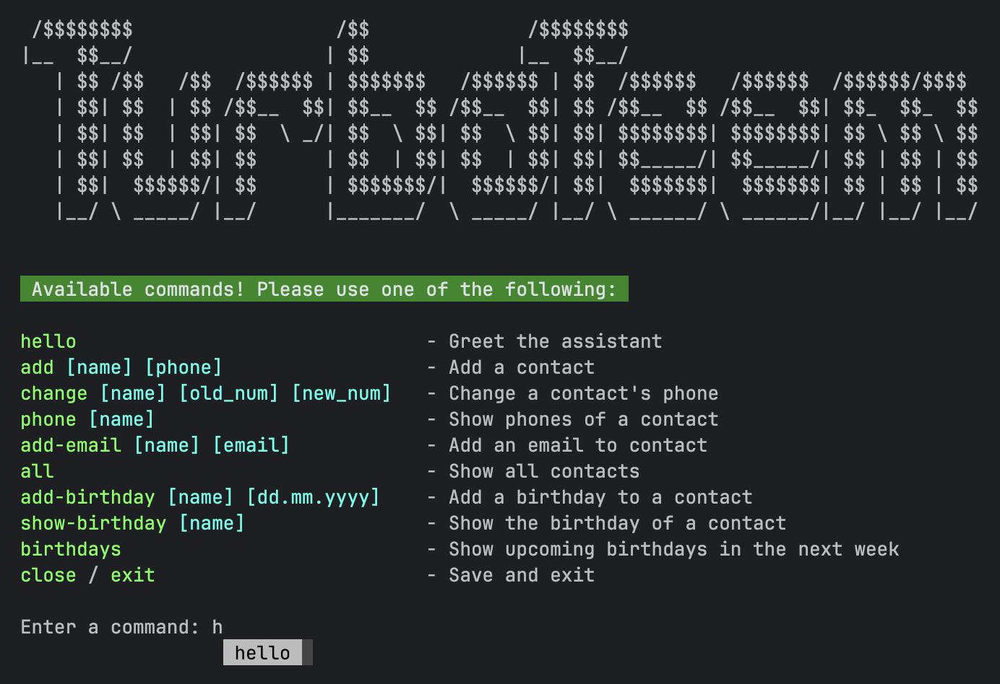

# PyhonBot by TurboTeem
### Ваш персональний помічник для зберігання контактів

---


---

Ви більше ніколи не сплутаєте свої контакти разом з унікальним рішенням від команди ***TurboTeem***

---

#### Зберігате контакти
Разом з:
 - Iменами, 
 - Aдресами
 - Номерами телефонів
 - Email 
 - та днями народження до книги контактів!

---

#### Виводьте список контактів

у яких день народження через задану кількість днів від поточної дати

--- 

#### Перевіряйте правильність

Валідйуте правильність введеного номера телефону та email під час створення або редагування запису та повідомляти користувача у разі некоректного введення

#### А також:
- Здійснйте пошук контактів серед контактів книги
- Редагуйте та видаляйте записи з книги контактів 
- Зберігайте нотатки з текстовою інформацією 
- Пошук за нотатками
- Редагуйте та видаляти нотатки

---

### Інструкція з користування:

- Встановіть Python 3.8+
- Виконайте `pip install -r requirements.txt`
- Запустіть програму `python main.py`
- Почніть друкувати одну з підтримуваних команд, зручний автокомліт підставить коректну назву
- Введіть `close` або `exit` щоб вийти з програми

### Список доступних команд

```
hello                              - Greet the assistant
add [name [phone]                  - Add a contact
change [name] [old_num] [new_num]  - Change a contact's phone
phone [name]                       - Show phones of a contact
add-email [name email]             - Add an email to contact
all                                - Show all contacts
add-birthday [name [dd.mm.yyyy]    - Add a birthday to a contact
show-birthday [name]               - Show the birthday of a contact
birthdays                          - Show upcoming birthdays in the next week
close / exit                       - Save and exit
```
